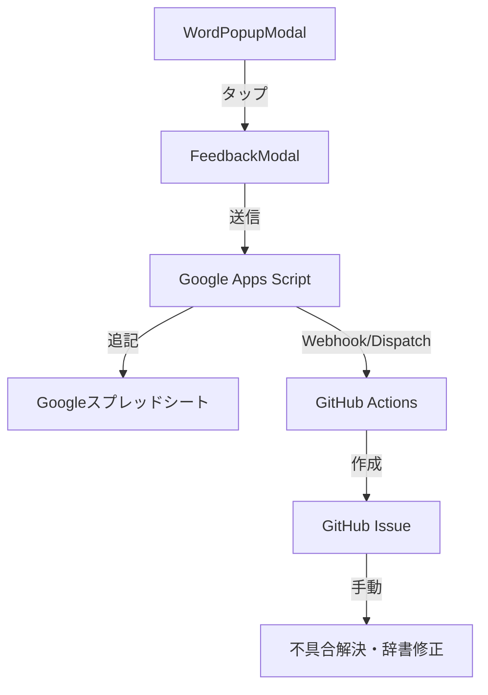

# 検索不具合フィードバック機能 実装計画書

## 1. 目的
ユーザーが単語検索で期待した結果が得られなかった場合に、簡単に不具合を報告できる仕組みを導入する。これにより、辞書データの拡充や検索ロジックの改善を効率化する。

## 2. システム構成
以下のフローで、ユーザーのフィードバックを GitHub Issue に統合する。

### 構成要素
1.  **Frontend (React Native / Expo)**:
    - 既存の「単語登録ポップアップ」にフィードバックアイコンを追加。
    - フィードバック用入力フォーム（モーダル）の実装。
2.  **Middleman (Google Apps Script - GAS)**:
    - アプリからのデータを受信。
    - スプレッドシートへのログ保存。
    - GitHub Actions を起動（`repository_dispatch` イベントを送信）。
3.  **Automation (GitHub Actions)**:
    - GASからの通知をトリガーに起動。
    - 届いたデータを整形し、自動的に GitHub Issue を作成。
4.  **Backend (GitHub Issues)**:
    - 開発者が確認・管理するためのタスク。

## 3. 実装詳細

### 3.1. フロントエンドの変更
- **ファイル**: `src/components/WordPopup.tsx`（旧 `WordPopupModal.tsx` より統合）
- **アイコン**: 検索結果が表示されるヘッダー部分に `MessageSquareShare` アイコンを配置。
- **フォーム内容**:
    - 検索した単語（自動入力）
    - 期待していた意味（任意）
    - 追加コメント（任意）

### 3.2. GAS の設定
- **機能**:
    - `doPost(e)` による受信。
    - `SpreadsheetApp` を使ったデータ追記。
    - `UrlFetchApp` を使った GitHub API への POSTリクエスト（`repository_dispatch`）。
    - GitHub Actions からのステータス更新リクエスト受信と反映。
- **認証**:
    - GitHub の Personal Access Token (PAT) を GAS のプロパティに保持。

### 3.3. GitHub Actions の設定
- **ワークフロー定義**: `.github/workflows/feedback-integration.yml`
- **トリガー**: `repository_dispatch` (event_type: `feedback-received`)
- **ジョブ**:
    - `actions/github-script` を使用して Issue を作成。
    - Issue クローズ時に GAS 経由でスプレッドシートのステータスを「解決済み」に更新。

## 4. セキュリティ
- GitHub PAT はアプリに含めず、GAS側で安全に保持する。
- GAS の Webアプリケーション URL は、`src/constants/config.ts` で管理。

## 5. ステップ・バイ・ステップの作業予定 ✅ 全工程完了

1.  **[GAS]** ✅ Googleスプレッドシートの作成およびGASの実装。
2.  **[GitHub Actions]** ✅ Issue作成・ステータス連携用ワークフローの作成。
3.  **[GAS]** ✅ GASからGitHub Actionsを叩くテスト。
4.  **[Frontend]** ✅ `WordPopup.tsx` へのアイコン配置と `FeedbackModal.tsx` の作成。
5.  **[Frontend]** ✅ フィードバック送信ロジックの実装（GASへの通信）。
6.  **[Test]** ✅ 結合テスト（アプリから送信してIssueが立ち、クローズでスプレッドシートが更新されることを確認）。

## 6. 備考
- GitHub Actions を介さず GAS から直接 Issue を作成することも可能だが、Issue テンプレートの適用や複雑な加工を行う場合は Actions を介す方が柔軟性が高い。今回は要望通り Actions 構成とする。
